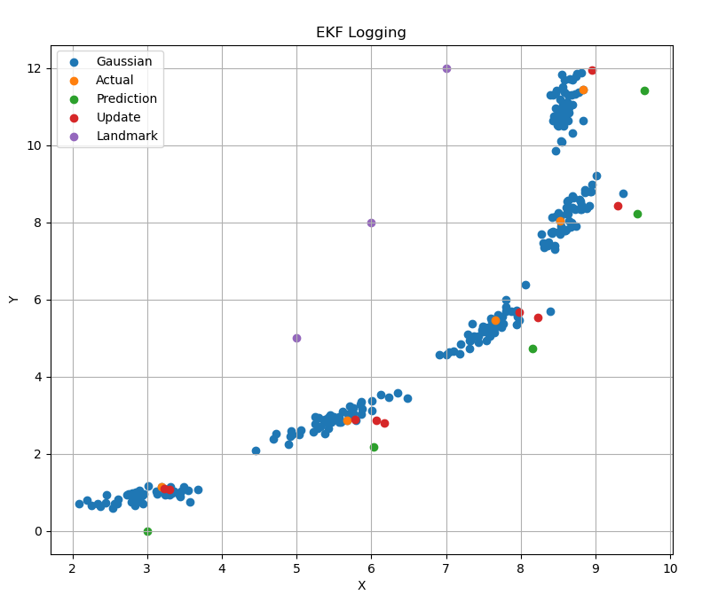

# EKF Exercise

This project demonstrates an implementation of the Extended Kalman Filter (EKF) using modern C++.

## Requirements

- C++17 or later
- CMake 3.10+
- Eigen3

## Build Instructions

```bash
git clone https://github.com/moralkerim/EKF-Exercise.git
cd EKF-Exercise
mkdir build && cd build
cmake ..
make
```

## Usage
Run the code:
```bash
cd build
./ekf_main
```

Move log file next to plotter:
```bash
cp poses.txt ~/EKF-Exercise/plotter
python3 plotter.py
```
You should see random robot poses, EKF prediction and EKF update poses.



## Playing with the Code
You can tweak robot and EKF parameters to see their effect. Noise parameters available in both EKF and Robot classes:
```bash
float r_d = 0.01;
float r_a = 0.001;

float q_x = 0.5;
float q_y = 0.5;
float q_t = 0.034;
```

You can change robot input to change its position

```bash
double dt = 1.0;
double v = 3.0;    // Linear speed
double w = 0.3;    // Angular speed
```

You can change or add new landmarks

```bash
// Landmarks as unordered maps
std::unordered_map<int, std::shared_ptr<Landmark>> landmarks;
landmarks.emplace(1, std::make_shared<Landmark>(1,  5.0f,  5.0f));
landmarks.emplace(2, std::make_shared<Landmark>(2,  6.0f,  8.0f));
landmarks.emplace(3, std::make_shared<Landmark>(3,  7.0f,  12.0f));
```


## Project Structure

- `src/` - Source code
- `include/` - Header files

## License

This project is licensed under the MIT License.